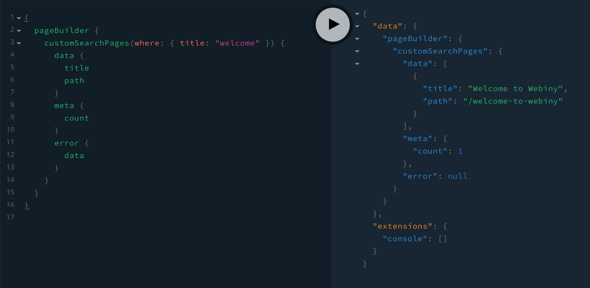

# Introduction

With this example, we show how you can perform custom searches on pages, using ElasticSearch which is included in the default Webiny setup.

> TIP: When it comes to performing advanced text and filtering queries, by default, every Webiny CMS project relies on Elasticsearch.

So, once you implement this example, via your [API Playground](https://www.webiny.com/docs/how-to-guides/webiny-applications/admin-area/api-playground/), you should be able to perform queries like:

```graphql
{
  pageBuilder {
    customSearchPages(where: { title: "welcome" }) {
      data {
        title
        path
      }
      meta {
        count
      }
      error {
        data
      }
    }
  }
}
```



# Implementation

In order to implement this, we've simply created a new [`GraphQLSchemaPlugin`](https://github.com/webiny/webiny-js/blob/v5.11.0/packages/handler-graphql/src/plugins/GraphQLSchemaPlugin.ts#L10), in [`/api/code/graphql/src/plugins/pagesCustomSearch.ts`](./api/code/graphql/src/plugins/pagesCustomSearch.ts:39).

Once created, we've imported and registered the plugin in [`api/code/graphql/src/index.ts`](./api/code/graphql/src/index.ts:27)

# Sample Data

In order to easier understand how the ElasticSearch query works, we've included some sample data [here](./pagesIndexSample.json). Notice how we have both `latest: true` and `published: true` entries for each page. So, when performing searches, you'll need to also append the proper filter (shown in the example code).

# Want to inspect your own ElasticSearch cluster and the data in it?

To explore your up and running ElasticSearch cluster, we recommend the [aws-es-kibana](https://www.npmjs.com/package/aws-es-kibana) library.

