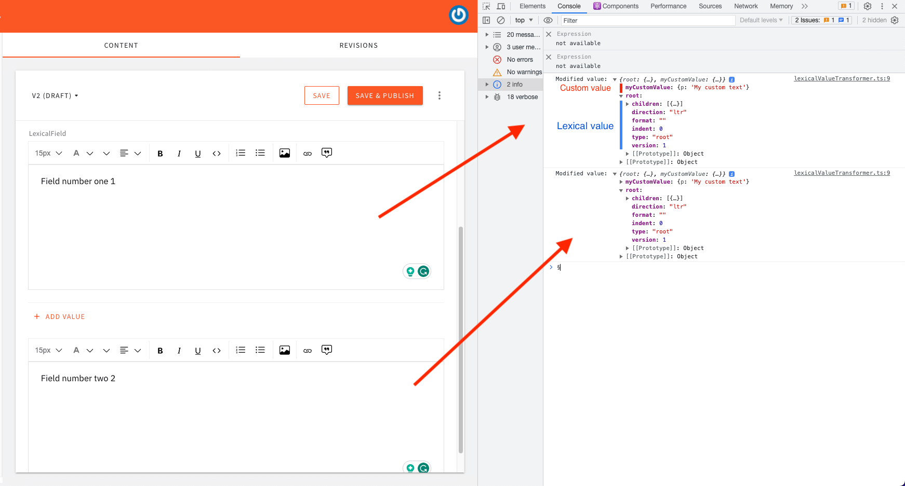
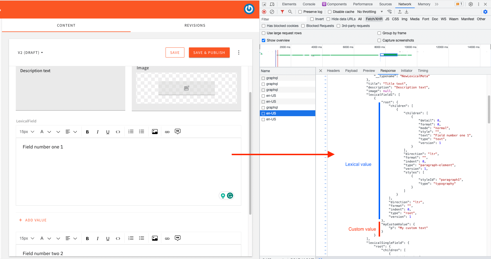

# Transform Rich Text Field Value On Save

This example shows how you can transform the form field's value before it's saved into the database. We took as an example the rich text field that uses Lexical Editor.

## How it works

Before the model's data is saved into the database, the transformer function will execute. Now, you can transform and return the modified JSON data.



After, Webiny will store your transformed data in the database. We can see when we refresh the page that the retrieved data contain the extra value.




### Register the transformer

Go to `apps/admin/src/plugins/index.ts` file and register your transformer and other custom plugins.

```ts
import { plugins } from "@webiny/plugins";
...
import customCmsPlugins from "./headlessCMS/customCmsPlugins";

plugins.register([
    ...
    /**
     * Headless CMS app.
     */
    headlessCmsPlugins,
    // regester your custom plugins here
    customCmsPlugins,
    ...
]);
```
