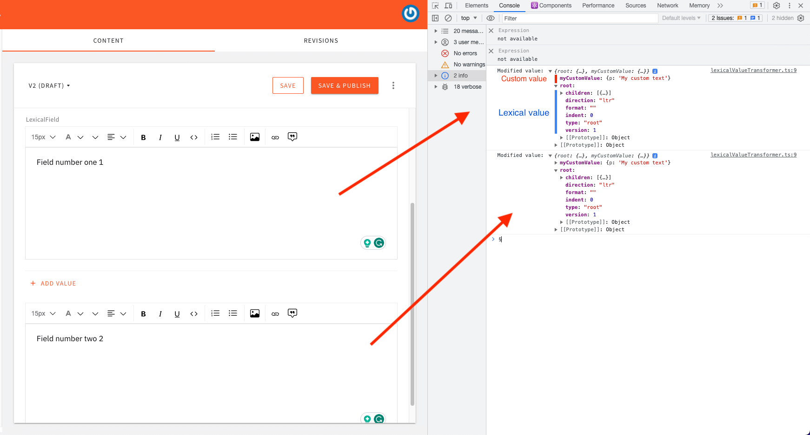
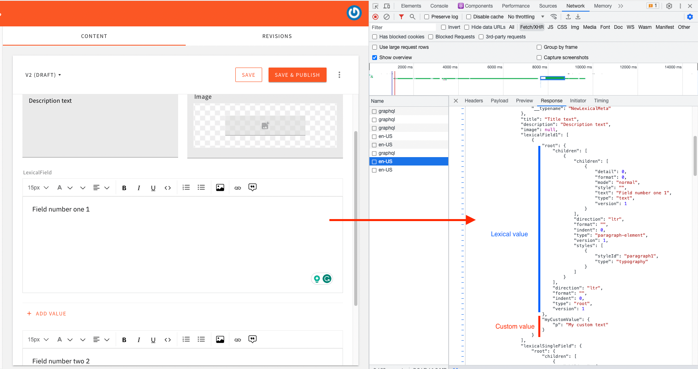

# Transform Rich Text Field Value On Save

This example shows how you can transform form field values, before the entire form is sent to the API. As an example, we're using the rich text field, which uses the Lexical editor.

## How it works

Before the model's data is sent to the API, we run a series of plugins, allowing them to transform the data before sending it to GraphQL. The plugin in this example adds a custom property `myCustomValue` to the Lexical data object.



Once the data is retrieved from the API, you will notice the custom property in the network response.




### Register the Transform Plugin

Go to `apps/admin/src/plugins/index.ts` file and register your transformer and other custom plugins.

```ts
import { plugins } from "@webiny/plugins";
...
import customCmsPlugins from "./headlessCMS/customCmsPlugins";

plugins.register([
    ...
    /**
     * Headless CMS app.
     */
    headlessCmsPlugins,
    // regester your custom plugins here
    customCmsPlugins,
    ...
]);
```
