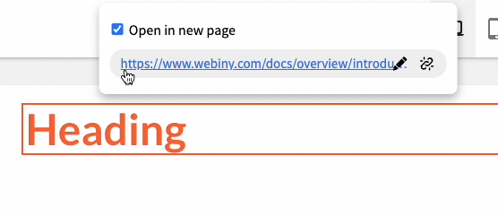
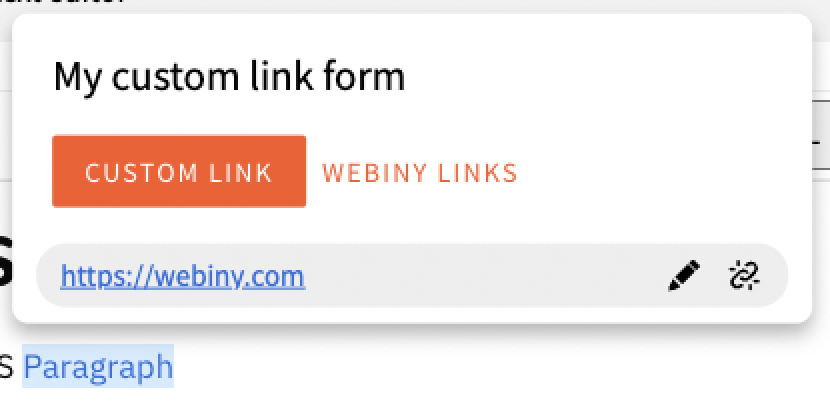
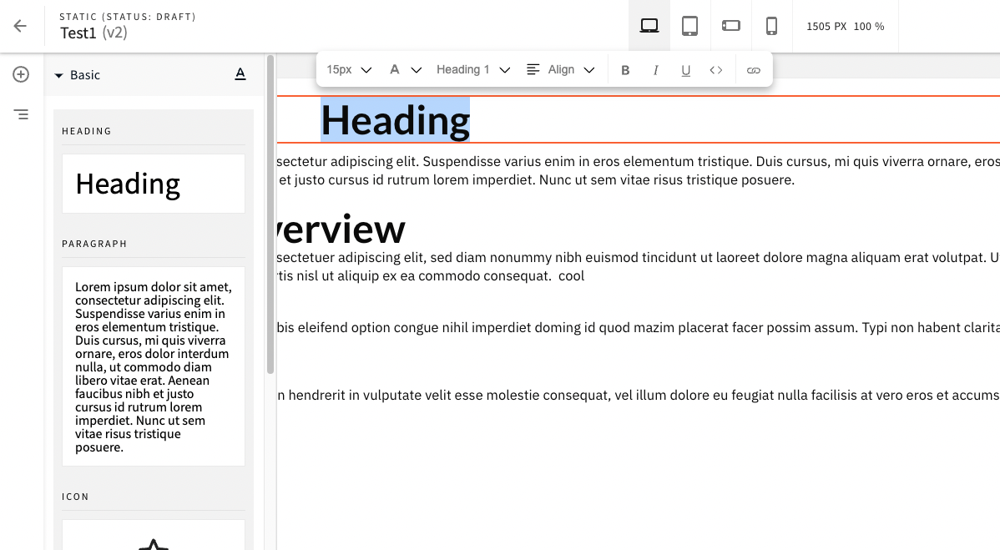
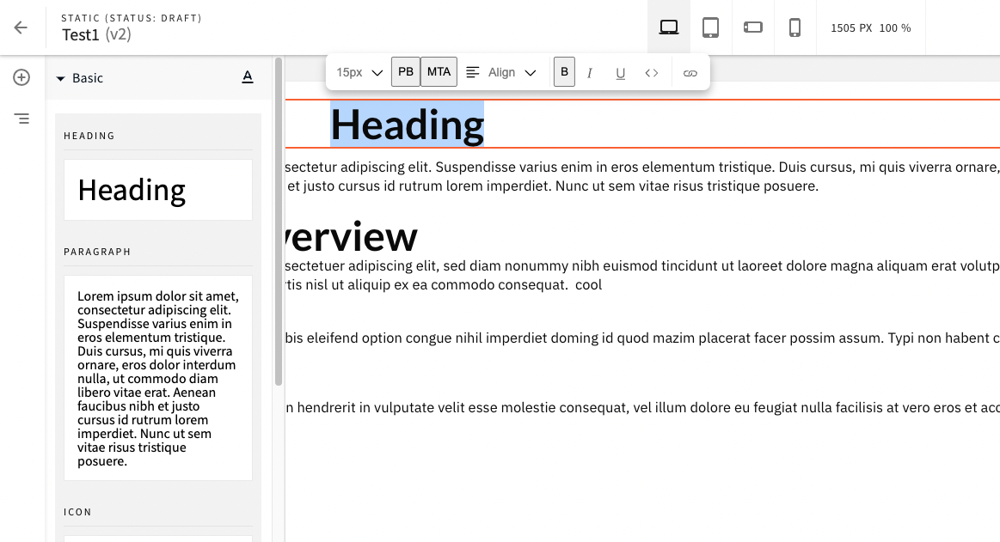
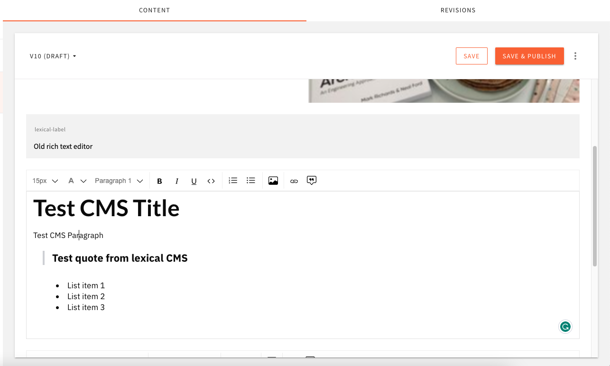
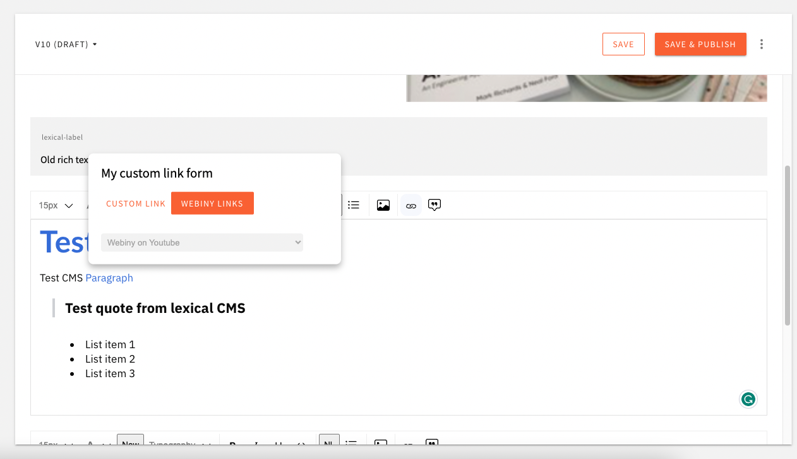
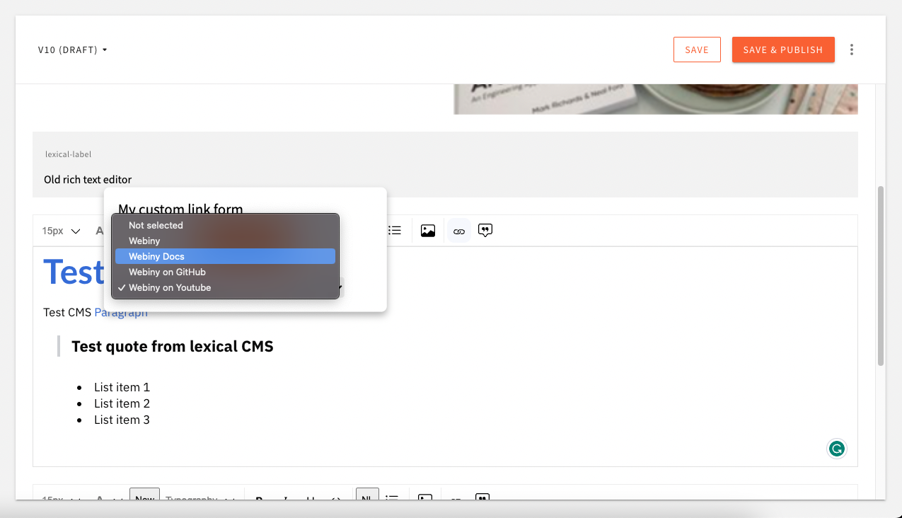

# Lexical Editor - Link Plugin Tutorial

# Introduction

Webiny implements the Lexical Editor for rich text editing. Lexical Editor is open-source and created by Meta. We are using Lexical editor in the Page Builder and Headless CMS apps to allow users a better editing experience.

<aside>
⚠️ Before you start with this tutorial please download the example files and add them to your project. In this tutorial will not cover every detail of the implementation.

</aside>

# Technical overview

Webiny provides configuration API for customizing the Lexical editor. Developers can customize the toolbar actions, plugins, and add lexical nodes.

As a general guidance, when you try to configure Lexical Editor in any of the Webiny apps or packages you need to import the root configuration component `LexicalEditorConfig` and nest other configuration components.

To customize the Lexical Editor in the Page Builder App, you need to import the Configuration API from the `@webiny/app-page-builder.`

To customize the Lexical Editor in Headless CMS you need to import the Configuration API from the `@webiny/app-headless-cms` .

# Customize the Link editing feature

Our goal in this example is to implement our custom toolbar link action and implement our custom floating popup link plugin. We want to change how users add/edit links in the Page Builder and Headless CMS apps.

For that purpose, we will create a custom toolbar action and custom plugin. Next, we will import the configuration components from the `@webiny/app-page-builder` package and `@webiny/app-headless-cms` and implement our own custom logic

## Create a custom link toolbar action

The best way to start and create a toolbar action is to check our [toolbar actions components](https://github.com/webiny/webiny-js/tree/dev/packages/lexical-editor/src/components/ToolbarActions) in `@webiny/lexical-editor` package and create a similar component for your case.

In our case we will create and customize the [toolbar link action](https://github.com/webiny/webiny-js/blob/dev/packages/lexical-editor/src/components/ToolbarActions/LinkAction.tsx) .

In components folder we have the action and in the assets folder we have the icons.

## Create a custom floating link popup

Our goal in this tutorial is to change the UI and functionality of the default floating link popup. In our case we want to allow user to have option to select and enter custom link and option to select already predefined links from list.

On the image below we can see the default implementation.



So let’s start building our custom floating popup UI, first, we will copy the `FloatingLinkEditorPlugin` plugin and css files from the [Webiny repository](https://github.com/webiny/webiny-js/tree/dev/packages/lexical-editor/src/plugins/FloatingLinkEditorPlugin), and customize the UI and functionality.

```jsx
<div ref={editorRef} className="custom-link-editor">
            <>
                <h1 className={"custom-link-title"}>My custom link form</h1>
                <div className={"custom-link-menu"}>
                    <button className={`webiny-ui-button webiny-ui-button--secondary mdc-button mdc-button--dense mdc-button--outline ${showInputType === "custom-link-input" ? "mdc-button--unelevated": ""}`}
                            onClick={() => setShowInputType("custom-link-input")}>Custom link</button>
                    <button className={`webiny-ui-button mdc-button mdc-button--dense ${showInputType === "select-link-input" ? "mdc-button--unelevated ": ""}`}
                            onClick={() => setShowInputType("select-link-input")}>Webiny links</button>
                </div>
                {isEditMode ? (
                    <>
                        <LinkEditForm
                            showInputType={showInputType}
                            linkUrl={linkUrl}
                            lastSelection={lastSelection}
                            inputRef={inputRef}
                            setEditMode={setEditMode}
                            editor={editor}
                            setLinkUrl={setLinkUrl}/>
                    </>
                ) : (
                    <>
                        <LinkPreviewForm showPreviewForInputType={showInputType} linkUrl={linkUrl} setEditMode={setEditMode} removeLink={removeLink} />
                    </>
                )}
            </>
        </div>
```

We created `CustomFloatingLinkEditorPlugin.tsx` file and implemented simple tab menu that have ***Custom Link*** and ***Webiny Links*** buttons. They will show the custom editing input and list with predefined links respectively. With this we have added custom css styles in the `CustomFloatingLinkEditorPlugin.css` file.

Here is the preview of our style and functional changes.



<aside>
👉 If you only have added the files in the plugins folder ind the admin/plugins folder you still can’t see the changes, later in this tutorial will cover how all of this changes will be visible in the Page Builder and Headless CMS apps.

</aside>

### View and edit forms

We have two forms, one is ***preview*** ***form*** when user can only view and test the link and ***edit form***  where user can edit the link or select one from the predefined links.

We have two for components:

`LinkPreviewForm` - user only can view the custom link or selected link

`LinEditForm` - user can edit the custom link or select one of the predefined links

Let’s see a part of the implementation of the edit form

```jsx
<>
            {showInputType === "custom-link-input" &&
                <input
                    ref={inputRef}
                    className="custom-link-input"
                    value={linkUrl}
                    onChange={event => {
                        setLinkUrl(event.target.value);
                    }}
                    onKeyDown={event => {
                        if (event.key === "Enter") {
                            event.preventDefault();
                            setUrlToLinkNode(linkUrl);
                        } else if (event.key === "Escape") {
                            event.preventDefault();
                            setEditMode(false);
                        }
                    }}
                />}
            {showInputType === "select-link-input" &&
                <LinkSelect url={linkUrl} onChange={(e) => onChange(e)} />}
        </>
```


As we can see `showInputType` prop is the state that is changed by that tab menu button click.

When ***Custom Link*** button is clicked `showInputType` will change the state to ***“custom-link-input”*** and the custom input will be visible to the user.

When ***Webiny Links*** button is clicked `showInputType` state will changed to ***“select-link-input”*** and link selection list will be visible to user***.***

### Link selection

We created Link Selection component called `LinkSelect` where all of the predefined links will be visible to the user.

```jsx
export const LinkSelect: FC<LinkSelectProps> = ({ url, onChange, disabled }) => {
    return (
        <select className={"internal-link-selection"} value={url} name="webiny-links"  onChange={(e) => { if(onChange) { onChange(e) } }}
            disabled={disabled}>
            <option value="" selected>Not selected</option>
            <option value="https://www.webiny.com">Webiny</option>
            <option value="https://www.webiny.com/docs/overview/introduction">Webiny Docs</option>
            <option value="https://github.com/webiny/webiny-js">Webiny on GitHub</option>
            <option value="https://www.youtube.com/@Webiny">Webiny on Youtube</option>
        </select>
    )
}
```

Here is the code sample from the LinkSelect component.

<aside>
☝ You can implement API calls and have a dynamic selection list.

</aside>

Now our custom plugin and action component are ready to be implemented. Next, we will show how our components can be hooked into the Page Builder and Headless CMS apps with the help of our Lexical configuration API.

# Customize the Lexical Editor in Page Builder App

To customize Lexical Editor in the Page Builder you need to import the root configuration component `LexicalEditorConfig` from the `@webiny/app-page-builder` package.

We will create a [PbLexicalEditorPlugin.tsx](https://github.com/webiny/webiny-examples/pull/158/files#diff-08635a6e0104d79358cadfa6932c3e85cdf1ac746f10d710457ab9f6aeffcad1) plugin file an import the configuration components.

```jsx
import React from "react";
import { LexicalEditorConfig } from "@webiny/app-page-builder";
...

const { Heading, Paragraph } = LexicalEditorConfig;
...
```

We can see that `LexicalEditorConfig` has two more configuration components:

`Heading` - allows you to hook into the Lexical Editor configuration for ***Heading Component.***

`Paragraph` - allows you to hook into the Lexical Editor configuration for ***the Paragraph component.***



Now  with the configuration components we can modify the toolbar and add our custom actions and the custom floating link popup.

```jsx
vexport const LexicalHeadingEditor = () => {
    return (
        <LexicalEditorConfig>
            <Heading.ToolbarAction name={"fontColor"} element={<button>PB</button>} />
            <Heading.ToolbarAction name={"divider3"} remove />
            <Heading.ToolbarAction name={"typography"} remove />
            <Heading.ToolbarAction
                name={"myToolbarAction"}
                after={"fontColor"}
                element={<button>MTA</button>}
            />
            <Heading.ToolbarAction name={"bold"} after={"italic"} element={<button>B</button>} />
            <Heading.Plugin name={"floatingLinkEditor"} element={<CustomFloatingLinkEditorPlugin />} />
        </LexicalEditorConfig>
    );
};

export const LexicalParagraphEditor = () => {
    return (
        <LexicalEditorConfig>
          <Paragraph.ToolbarAction name={"link"} remove />
          <Paragraph.ToolbarAction name={"custom-link-action"} element={<CustomLinkAction />} />
           <Paragraph.Plugin name={"floatingLinkEditor"} element={<CustomFloatingLinkEditorPlugin />} />
        </LexicalEditorConfig>
    );
};

export const PbLexicalEditorPlugin = () => {
    return (
        <>
            <LexicalParagraphEditor />
            <LexicalHeadingEditor />
        </>
    );
};
```

For better organization, we split the configuration into two separate Heading and Paragraph components.

For the heading Lexical Editor, we access with Heading configuration options. We have how to add, update and remove actions. We use plugin configuration to specify the name of the default plugin and override `FloatingLinkPLugin`  with our custom `CustomFloatingLinkPLugin` component.

To view the changes in place the `PbLexicalEditorPlugin` component into  `apps/admin/src/App.tsx` component. In the code below you can see the example.

```jsx
export const App: React.FC = () => {
    return (
        <Admin>
            <Cognito />
            <PbLexicalEditorPlugin />
        </Admin>
    );
};
```

Here is the result, Page Builder app have custom actions.



# Customize the Lexical Editor in Headless CMS App

To hook into the Lexical editor in the Headless CMS ***app***, you need to import the Lexical configuration API from the `@webiny/app-headless-cms` package.



First, we need to import the root configuration component `LexicalEditorConfig`.

```jsx
import React from "react";
import { LexicalEditorConfig } from "@webiny/app-page-builder";
...

const { ToolbarAction, Plugin, Node } = LexicalEditorConfig;
...
```

The difference in the API from the Page Builder app is that here we have only one Lexical Editor configuration.

So the `LexicalEditorConfig` will export directly the ToolbarAction, Plugin, and Node.

In our example, we will create [CmsLexicalEditorPlugin.tsx](https://github.com/webiny/webiny-examples/pull/158/files#diff-9b5bb39a87c3d0c32d23d3c57631c0bc91ba431074d25fcaed792de458b49c1a) file where we can write our Lexical Editor configurations.

```jsx
import React from "react";
import { LexicalEditorConfig } from "@webiny/app-headless-cms";
import {CustomFloatingLinkEditorPlugin} from "./plugins/CustomFloatingLinkEditorPlugin/CustomFloatingLinkEditorPlugin";

const { Plugin, ToolbarAction } = LexicalEditorConfig;

export const CmsLexicalEditorPlugin = () => {
    return (
        <LexicalEditorConfig>
         <ToolbarAction
                after={"fontColor"}
                name={"myComponent"}
                element={<button>New</button>}
            />
            <ToolbarAction name={"numberedList"} element={<button>NL</button>} />
            <Plugin name={"floatingLinkEditor"} element={<CustomFloatingLinkEditorPlugin />} />
        </LexicalEditorConfig>
    );
};
```

Here is the result from the configuration:

To view the changes in place the `CmsLexicalEditorPlugin` component into  `apps/admin/src/App.tsx` component. In the code below you can see the example.

```jsx
export const App: React.FC = () => {
    return (
        <Admin>
            <Cognito />
            <PbLexicalEditorPlugin />
						<CmsLexicalEditorPlugin />
        </Admin>
    );
};
```

Here is the result, Page Builder app have custom actions.



On the image below you can see now user can select from predefined links:



# References

Webiny lexical editor package: [https://github.com/webiny/webiny-js/tree/dev/packages/lexical-editor](https://github.com/webiny/webiny-js/tree/dev/packages/lexical-editor)

Lexical Editor home page: [https://lexical.dev/](https://lexical.dev/)

Lexical Editor Playground: [https://playground.lexical.dev/](https://playground.lexical.dev/)

Bootstrap icons: [https://icons.getbootstrap.com/](https://icons.getbootstrap.com/)
