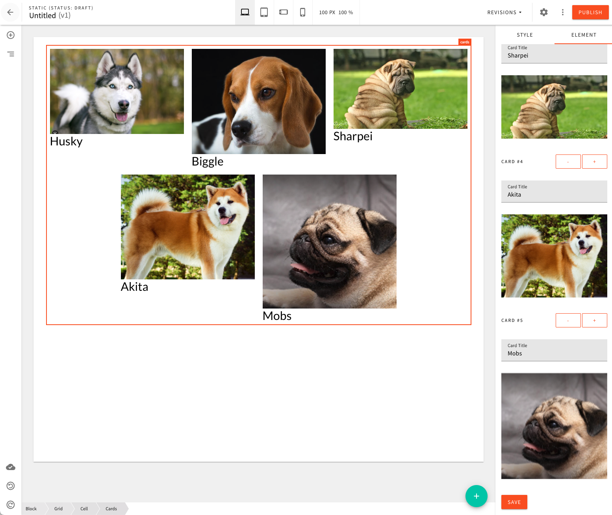

# Cards Page Element Example

This examples shows how to create a simple Cards page element.

The element allows the user to pick any number of cards to be rendered in the actual page element.

Every element consists of two fields: title and image (picked via Webiny's File Manager app). Of course, fields can be adjusted if need be.