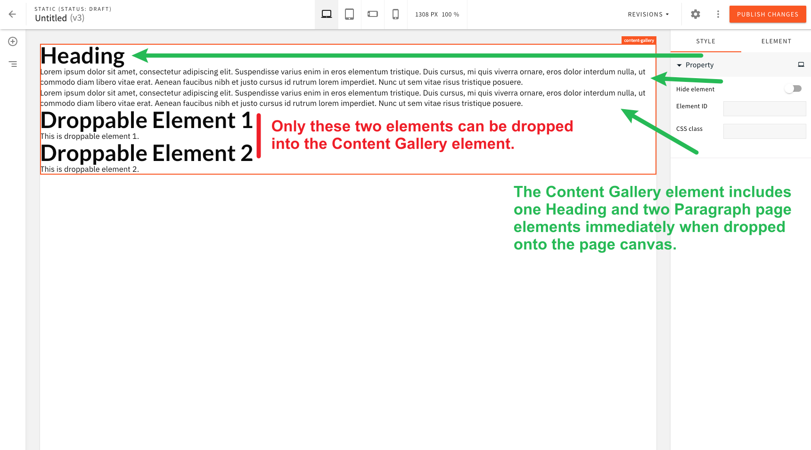
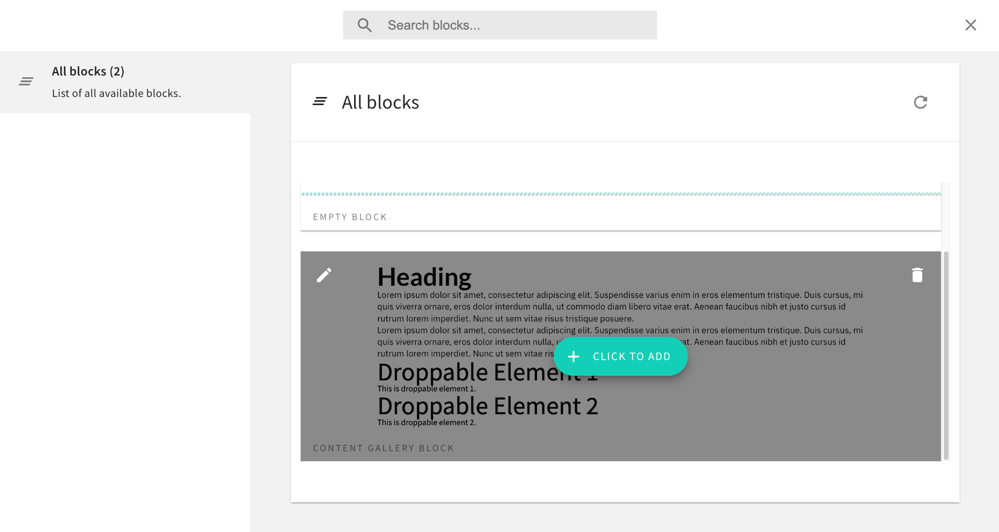

# Page Element With Child Elements

This example shows how to create a custom page element named **Content Gallery**, that can accept only a subset of other custom page elements as its children: **Droppable Element 1** and **Droppable Element 2** elements.

This example also goes a step further and shows how a custom page element can also initially include one or more existing page elements, once dropped onto the page canvas in the page editor. In this case, the **Content Gallery** element includes one heading and two paragraph elements. Since these are built-in elements, content editors can use them as if they were dropped manually onto the page canvas, meaning they can use the inline-editing capabilities out of the box. 

Finally, this example also show how we can register the "Content Gallery Block" block, which enables users to drop the block directly from the list of blocks. This makes the whole process a bit easier, since users do not need to first add a block to the page, and then drop the **Content Gallery** page element into it.

