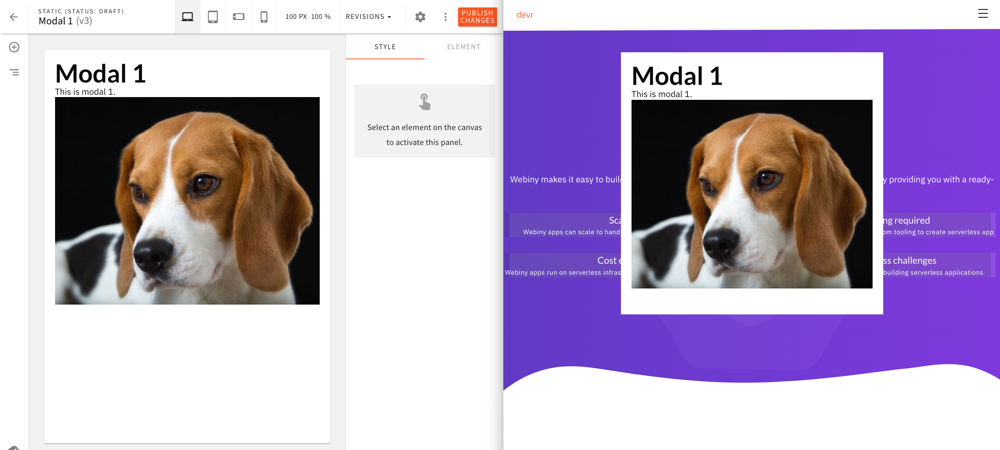

# Pages as Modal Content Example

This examples shows how to use Page Builder and its page designing capabilities to design content for one or multiple modals that are shown on the website.

For example, in the following screenshot, on the left, we can see a page with a heading, paragraph, and an image being designed in the page editor. Ultimately, on the right side, we can see the page being rendered as a modal on the website.

In short, the element allows the user to pick any number of cards to be rendered within the dropped page element.

Every card item consists of two fields: title and image. Of course, fields can be adjusted if need be. Also, the image field brings Webiny's File Manager app, so that the user can choose an image from an existing library of images.

All files are located in the [`/apps/theme/pageElements/cards`](https://github.com/webiny/webiny-examples/tree/master/page-builder/cards-page-element/apps/theme/pageElements/cards) folder.