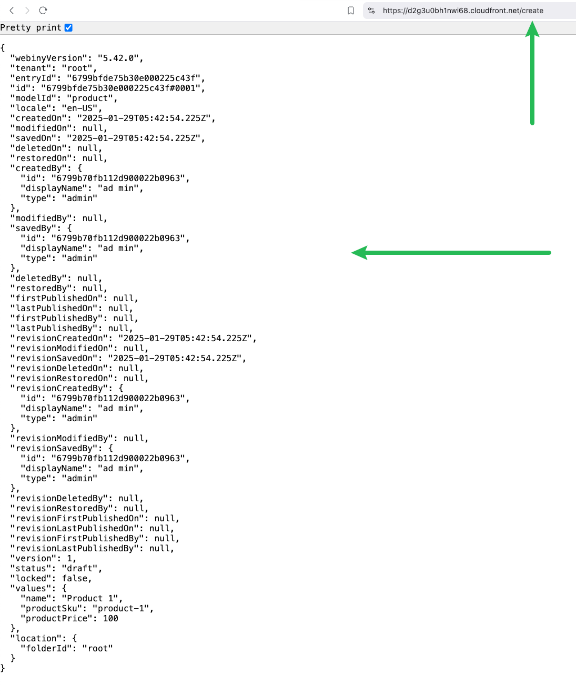

## Amazon Cognito Federation with Auth0

Built on the back of [this article](https://www.webiny.com/docs/core-development-concepts/extending-and-customizing/add-custom-route-to-existing-lambda), this extension demonstrates how to introduce a simple REST API endpoint that works side by side with the existing Webiny GraphQL API. In particular, the extension introduces a new `/create` endpoint, which, once invoked via a simple GET request, creates a new `Product` CMS content entry.

## Setup

Once downloaded, this extension does involve a manual step to set up. Without this step, the extension will not work.

The `extensions/cmsEntriesWithRest/createRestEndpoints.ts` file exports a single `createRestEndpoints` function. This function is used to configure the REST API endpoint in the Amazon API Gateway that Webiny deploys with every project.

The function must be imported and called in the `apps/api/webiny.application.ts` file:

```ts
import { createApiApp } from "@webiny/serverless-cms-aws";
import { createRestEndpoints } from "cms-entries-with-rest/src/createRestEndpoints";

export default createApiApp({
    pulumiResourceNamePrefix: "wby-",
    pulumi: app => {
        createRestEndpoints(app)
    }
});
```

With this manual step done, you can run the following command to deploy the changes:

```bash
yarn webiny deploy api --env dev
```

## Testing

To test the new `/create` endpoint, you can use a tool like `curl`:

```bash
curl -X GET https://xyz.cloudfront.net/create
```

> Note that `xyz` should be replaced with the actual CloudFront URL of your Webiny project.

Alternatively, you can simply enter the https://xyz.cloudfront.net/create URL in your browser:

